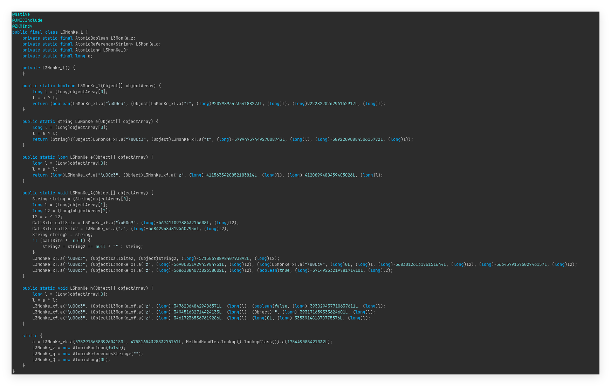

# Open-Sakura

<p>
    <a href="LICENSE"></a>

> [!CAUTION]
> 这个客户端的编码水平过于堪忧，严重怀疑秋奈的开发水平，因此如果你想要使用这个狗屎外挂我不推荐在主账户作弊

**Open-Sakura** 是Sakura Minecraft 客户端的语义还原代码版本 ，是由**各大先进LLM**以及方块人人工对字节码分析得到的。目标版本为 **Minecraft 1.21.11 Fabric，目前还原工作仍在火急火燎加急工作，如果王怡博先生继续急眼意淫，我们会加快进程。**

> [!Warning]
> 本仓库**仅供学习与研究目的发布** —— 用于研究客户端侧游戏改造。在你不拥有的服务器上使用作弊客户端违反绝大多数服务器规则，请自行承担后果。

## 许可
本仓库以GPLV3协议开放，构建脚本与文档**仅供研究与学习使用**。如果你是 Sakura 的原作者并希望本仓库下架或重新授权，请提交一个 Issues。虽然提了也不会搭理你，可能你还会遭受更多的嘲讽。

## 声明
破解者对本外挂的其他作者没有敌意，请放下戒备。如果你希望你的外挂不被再次破甲可以加强你的混淆，虽然加强了AI以及人工也能解。更加一劳永逸的办法是将秋奈从你们客户端的开发组内部踢出，避免更多节外生枝。

## 构建

```bash
git clone https://github.com/AirFoundation/Open-Sakura-1.21.11.git
cd Open-A
./gradlew build
```

## 关于开发者之一-秋奈(PhiLia)

- 开发者是MTF，OD神
- 喜欢在各大QQ群碰瓷各大客户端与热摄入（举例:Zen/Rhythm/Cherish/Atri）
- 吃玉米片OD给脑子O坏掉了导致他认为一个热摄入作者需要巴结一个新加坡入的方块人卡网
- 吃玉米片OD给脑子O坏掉了导致他认为破甲者应该使用字节码修补他的狗屎绕过使其变得可以使用
- 使用ZKM21破甲版+JNIC3.5.1破甲版进行混淆（然而JNIC3.5.1破甲版并不能混淆1.21.11）
- 客户端绕过过于狗屎导致用户在大厅站着死号
- 此人外挂有安装偷取Token小偷的前科

## JAR 结构分析

> 以下分析皆基于 Opus 4.8 调用 Recaf MCP 对原始混淆 JAR 的直接字节码检查。

### 类统计

| 包路径 | 类数量 | 说明 |
|---|---|---|
| `dev/sakura/client/mixin` | 约 70 | Mixin 注入类（全部混淆命名 A-Z、a-z、aa-az） |
| `dev/sakura/client` | 约 530 | 功能模块类（全部以 `L3MonKe_*` 命名） |
| `dev/sakura` | 约 10 | 授权 / 网络认证类 |
| `L3MonKe` | 1 | InvokeDynamic 字符串解密 Bootstrap（`L3MonKe_t`） |
| `jnic` | 1 | 虚假 Native 保护注解（`JNICInclude`，空接口，无 `.so`/`.dll`，无任何Loader） |
| `niurendeobf` | 1 |  ZKM InvokeDynamic 标记注解 |
| **合计** | **644** | |

### 混淆技术

| 技术 | 实现方式 | 效果 |
|---|---|---|
| **ZKM String Encryption** | 全局字符串常量替换为 InvokeDynamic 调用，Bootstrap 在 `L3MonKe/L3MonKe_t` 和 `dev/sakura/L3MonKe_H` | 静态字符串搜索完全失效 |
| **ZKM InvokeDynamic** | 方法调用经由 `MutableCallSite` 延迟绑定，实际目标在运行时填充 | 静态调用图分析断链 |
| **控制流混淆** | 部分方法内存在未参与计算的 `long` 花指令（XOR 链）、假条件跳转 | 增加反编译阅读难度 |
| **虚假 JNI 标记** | 每个类上标注 `@JNICInclude` 注解，JAR 内无任何 Native 库或 `dev/jnic` 路径 | 恐吓反编译者，实际无效 |
| **全类名混淆** | 所有非 Mixin 类均命名为 `L3MonKe_<字母/数字>` | 语义完全丢失 |

### 主框架类

| 类 | 功能 |
|---|---|
| `dev/sakura/client/L3MonKe_Nn` | **主客户端入口**：持有 `MinecraftClient` 引用、`Logger`、模块管理器 (`L3MonKe_iC`)、事件总线 (`L3MonKe_in`)、渲染管理器、配置管理器等 |
| `dev/sakura/client/L3MonKe_rk` | **ZKM 字符串解密调度器**：维护解密密钥表、InvokeDynamic 调用站点缓存 |
| `L3MonKe/L3MonKe_t` | **InvokeDynamic Bootstrap**：ZKM 字节→字符串解密入口，同时承载 `MethodHandles.Lookup` |
| `dev/sakura/L3MonKe_H` | **网络认证 / 授权系统**：含 AtomicBoolean、服务端 URL（加密）、HTTP 验证逻辑 |
| `dev/sakura/L3MonKe_G` | **授权数据对象**：`enabled`、过期时间戳、授权字符串 |


## 破甲方法

经过Opus 4.8长达18秒的分析，Opus认为所有的类由惨遭破甲的Zelix KlassMaster21（破甲版）混淆。除了Zelix的Invoke Dynamic和String Encryption外，还有部分未参与任何计算的Interger \ Long变量花指令代码和仅在部分方法中出现的Flow混淆。

然而Opus随即发现JAR内部并没有打包好的Native组件且JNIC破甲3.5.1不可以混淆MC 1.21.11客户端，以及这个jdk21的项目，随即认为这个JNICInclude其实是用于精神恐吓反编译者，整个jar包体内未有任何native混淆后的方法以及dev/jnic路径。

其中大部分类都可以经过小修小补的现有Zelix反混淆器与LLM完成，大部分Class都有一个虚假的JNICInclude注解，但实际上没有任何本地人混淆，导致在Java层中所有的代码暴露无遗。但可能由于精神女人在割掉自己的格调的时候失血过多导致昏迷，即使你没有通过客户端认证也可以完整加载Mixin并初始化所有的Class。因此我们修补了一些字节码获得了第一份破甲版并将惨遭ZKM21混淆的类以及由孤月茫开源的本客户端1.21.4版本交由LLM进行分析。

后续使用Opus 4.8对本项目及1.21.4项目经过长达6小时的修复分析与反混淆和少量的人工修复，便得到了这份源码。



## 截图


破甲时刻


GPT


Claude

## 聊天记录 & 笑点解析

> 卡网挨打割手手 - 我有抑郁症


> 叮咚鸡，叮咚鸡，大狗大狗叫叫叫。


> IShowSuperNoxzBypass!!!


> FakeAB导致弹弹乐，至于为什么疯狂回弹会牵扯到一个假的AutoBlock，笔者此处暂且蒙古。


> GrimFull in Heypixel


> Grim50% in Heypixel 


> 赢了之后退出重进绕过检测


> 原地死号 Moment


> 理性讨论，王一博可能OD给脑子O坏了/又或是吃雌二醇导致失去大脑 导致能说出自己的客户端是一坨狗屎这样的言论，我们在逆向过程中第一版发布的jar只删去了验证，模块一动未动，笔者在写这段话的时候不禁开怀大笑


## 致谢
> 感谢以下人物/项目在对本项目逆向工作中的支持与帮助。
- 原始混淆客户端：Sakura-1.1
- ChatGPT 5.5 xhigh和Claude Opus 4.8 ultracode
- ArbitraryOP(新时代LLM还原源代码)
- [BanCN](https://github.com/BanCN-Re)(老手艺入还原源代码)
- [LoveMon3tr](https://github.com/Lorypage/Open-Sakura/commits?author=Mon3tr-QwQ)(字节码修补)
- 秋奈(使用单ZKM21破甲版导致轻易破解)
- [Recaf MCP](https://github.com/sniperrich/RecafMCP)
- [孤月茫](https://github.com/Lorypage/Open-A#%E5%85%B3%E4%BA%8E%E5%BC%80%E5%8F%91%E8%80%85-%E5%AD%A4%E6%9C%88%E8%8C%ABprivate512)所开源的Sakura(Mahiro)1.21.4Fabric 对本项目的重命名以及还原工作提供了非常大的帮助